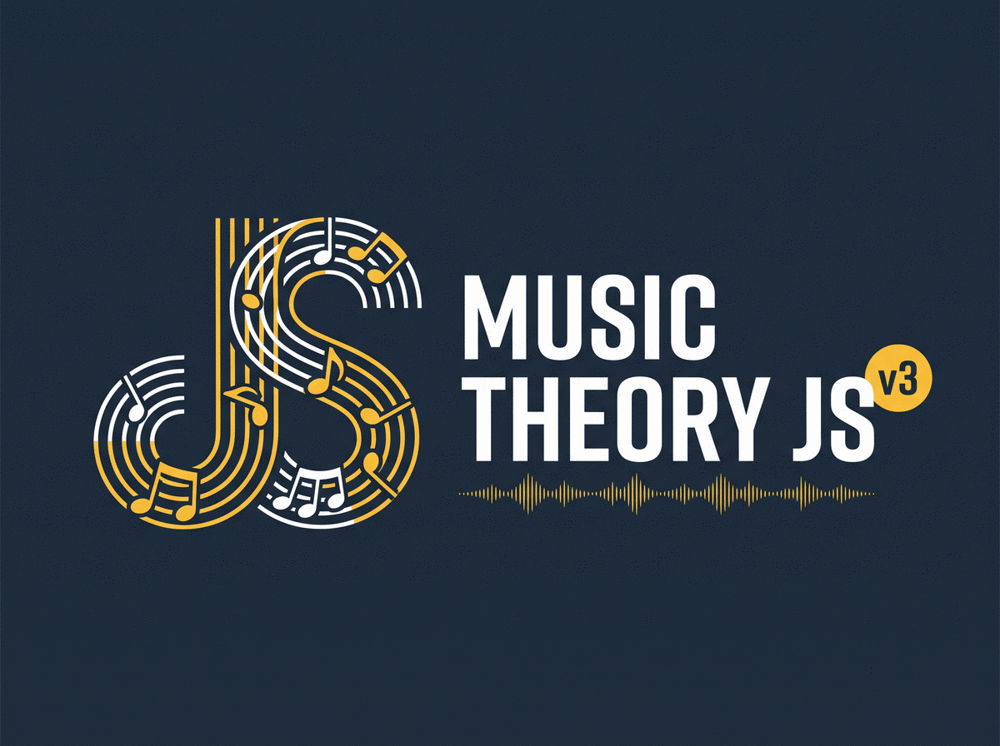

<p align="center">
  
</p>

<p align="center">
  <a href="https://www.npmjs.com/package/musictheoryjs"></a>
  <a href="https://github.com/Zachacious/MusicTheoryJS/actions/workflows/ci.yml"></a>
  
  
  
  
  
</p>

The fastest, most complete music theory library for JavaScript and
TypeScript.

MusicTheoryJS gives your code a working knowledge of music. It knows what
notes are in an Fm9, what key a melody is in, which scales fit over a G7alt,
and what frequency a quarter-tone above middle C is. Use it to analyze
performances and MIDI data, generate progressions and voicings in
composition tools, label scores with Roman numerals, build ear trainers and
theory apps, or drive synths with tuning systems most software can't
represent.

- **Zero runtime dependencies.** Nothing gets pulled into your tree but the
  code you call.
- **Tree-shakable to the function.** Import from `musictheoryjs/core` and
  ship under 3 KB min+gzip. The entire library, with all 106 chord types and
  92 scales, is about 19 KB. Eleven subpaths (`musictheoryjs/chord`,
  `/harmony`, `/tuning`, …) let a bundler drop what you don't touch.
- **Written in TypeScript.** Types ship in the package: `.d.ts` for every
  export and every subpath, no `@types` install, no `any` at the edges.
- **ESM, CommonJS, and a UMD script-tag build.** `import` and `require` both
  resolve to real builds with their own type declarations.
- **Immutable values.** Every operation returns a new frozen object, so
  notes and chords are safe to share, compare, and memoize.
- **Correct results.** `transpose("Eb4", "P5")` is `Bb4`, the C# major scale
  has an E# in it, and G# and Ab are different pitches when a tuning system
  needs them to be. [Here's why](#why-the-answers-come-out-right).
- **Documentation you can trust.** Every code sample in this README and
  every `@example` in the API docs runs in CI. When a `// =>` comment is
  wrong, the build fails.

```bash
bun add musictheoryjs   # or: npm i · pnpm add · yarn add
```

```ts
import { chord, scaleNotes, progressionChords, transpose, noteName, detectKeys } from "musictheoryjs";

scaleNotes("C major", 4); // => ["C4", "D4", "E4", "F4", "G4", "A4", "B4"]
chord("Cmaj7").notes; // => ["C", "E", "G", "B"]
progressionChords("C major", ["ii7", "V7", "Imaj7"]); // => ["Dm7", "G7", "Cmaj7"]
noteName(transpose("C4", "P5")); // => "G4"
detectKeys(["C4", "E4", "G4", "B4", "D5", "C5", "A4", "F4"])[0].name; // => "C major"
```

> Upgrading from the class-based v2? See the [migration guide](MIGRATION.md).

## Why the answers come out right

Most music software stores a note as a number from 0 to 11 and guesses at
its name when it has to print one. That guess is where wrong answers come
from: a minor third above C that comes back as D#, a "D# major" scale nobody
would write, tunings that can't tell G# from Ab even though they sound
different in meantone. MusicTheoryJS stores the note itself (letter,
accidental, octave) and runs interval math on that, so every result — every
chord tone, scale degree, and analysis — is the note a musician would
actually use. There is no guessing step for a bug to hide in.

```ts
import { transpose, noteName, distance, intervalName, scale } from "musictheoryjs";

noteName(transpose("Eb4", "P5")); // => "Bb4"
noteName(transpose("G#4", "M3")); // => "B#4"
scale("Cb major").notes; // => ["Cb", "Db", "Eb", "Fb", "Gb", "Ab", "Bb"]
intervalName(distance("C4", "Eb4")); // => "m3"
// distance() exactly inverts transpose(), and a property test holds it there:
noteName(transpose("C4", distance("C4", "F#4"))); // => "F#4"
```

The same policy applies to bad input. Creation functions throw a typed
`MusicTheoryError`, with a "did you mean" suggestion when a close match
exists, and every one has a `try*` variant that returns `null` instead.
Nothing silently falls back to a default and poisons the rest of your
pipeline.

```ts
import { chord, tryChord } from "musictheoryjs";

chord("Cmj7"); // => throws "did you mean"
tryChord("Cmj7"); // => null
```

Two more things worth knowing before the tour. Every function takes either
name strings (`"Eb4"`, `"m3"`, `"Cm7b5"`) or the corresponding objects;
string parsing is memoized, and objects skip parsing entirely. And
microtonality is built into the pitch type itself — `cents` lives on every
pitch, and the [tuning modules](#microtonality--tuning) cover EDO, just
intonation, temperaments, and MIDI pitch-bend.

## Imports

Import everything from the root, or from a subpath to keep bundles minimal:

```ts no-run
import { chord } from "musictheoryjs";          // root barrel
import { chord } from "musictheoryjs/chord";    // just the chord module
const { chord } = require("musictheoryjs");     // CommonJS works too
```

Subpaths: `core`, `pcset`, `dict`, `chord`, `scale`, `key`, `roman`,
`progression`, `harmony`, `micro`, `tuning` — each with its own types, ESM,
and CJS builds. A browser UMD bundle (`dist/musictheory.umd.min.js`, global
`MusicTheoryJS`) is included for script tags.

## Quick tour

```ts
import {
  chord, scale, majorKey, romanToChord, detectChords,
} from "musictheoryjs";

chord("Cm7b5").notes; // => ["C", "Eb", "Gb", "Bb"]
scale("F# dorian").notes; // => ["F#", "G#", "A", "B", "C#", "D#", "E"]
majorKey("Eb").chords; // => ["Ebmaj7", "Fm7", "Gm7", "Abmaj7", "Bb7", "Cm7", "Dm7b5"]
romanToChord("V7/V", "C major").symbol; // => "D7"
detectChords(["C", "Eb", "G", "Bb"])[0].symbol; // => "Cm7"
```

---

## The modules

### Notes & intervals (`musictheoryjs/core`)

The foundation: `Pitch` (`{ step, alt, oct?, cents? }`, frozen) and `Interval`
(`{ steps, semitones }` — letter distance plus chromatic distance, so quality
is exact). Parse, format, transpose, measure, convert to MIDI and frequency.

```ts
import { note, noteName, midi, freq, chroma, samePitch, sameSpelling, add, invert, intervalName } from "musictheoryjs";

note("F##3").alt; // => 2
midi("E5"); // => 76
freq("A4", { a4: 432 }); // => 432
chroma("B#"); // => 0
samePitch("D#4", "Eb4"); // => true
sameSpelling("D#4", "Eb4"); // => false
intervalName(add("M3", "m3")); // => "P5"
intervalName(invert("M3")); // => "m6"
```

A pitch without an octave is a pitch *class*. Most theory operates on those;
octaves come in for voicing, ranges, and audio. This module is the right
starting point for MIDI handling, transposition that respects notation, and
interval math.

### Pitch-class sets (`musictheoryjs/pcset`)

Sets as 12-bit integers ("chromas"): subset checks, equality, rotation, and
mode generation are single bitwise operations. This is the engine under chord
and scale detection.

```ts
import { chromaFromNotes, chromaContains, chromaIntervals, chordScales } from "musictheoryjs";

const cMajorScale = chromaFromNotes(["C", "D", "E", "F", "G", "A", "B"]);
chromaFromNotes(["C", "E", "G"]); // => 145
chromaContains(cMajorScale, chromaFromNotes(["D", "F", "A", "C"])); // => true
chromaIntervals(chromaFromNotes(["C", "E", "G", "Bb"])); // => ["P1", "M3", "P5", "m7"]
```

### Dictionaries & detection (`musictheoryjs/dict`)

106 chord types and 92 scale types, generated and verified, indexed by
chroma for detection. Results come back ranked: exact matches first, then
inversions, then partial matches, with slash basses identified from the
voicing.

```ts
import { getChordType, detectChords, detectScales, CHORD_TYPES, SCALE_TYPES } from "musictheoryjs";

CHORD_TYPES.length; // => 106
SCALE_TYPES.length; // => 92
getChordType("maj7").intervals; // => ["P1", "M3", "P5", "M7"]
detectChords(["E3", "C4", "G4"])[0].symbol; // => "C/E"
detectScales(["C", "D", "Eb", "F", "G", "Ab", "B"])[0].type; // => "harmonic minor"
```

### Chords (`musictheoryjs/chord`)

A full jazz-symbol tokenizer (extensions, alterations, add/omit, parentheses,
slash basses, `N.C.`), rich frozen `Chord` values, and exact spelling from
interval arithmetic.

```ts
import { chord, chordNotes, transposeChord, tokenizeChordSymbol } from "musictheoryjs";

chord("C13#11").notes; // => ["C", "E", "G", "Bb", "D", "F#", "A"]
chord("Cm(maj7)").symbol; // => "CmM7"
chord("Am7/G").bass; // => "G"
chordNotes("Cmaj9", 4); // => ["C4", "E4", "G4", "B4", "D5"]
transposeChord("Am7/G", "m3").symbol; // => "Cm7/Bb"
tokenizeChordSymbol("Am7/G").type.name; // => "minor seventh"
```

### Scales & modes (`musictheoryjs/scale`)

92 scale types with aliases, plus mode arithmetic done by rotation on the
parent's spelling — so modes inherit the right accidentals automatically.

```ts
import { scale, mode, scaleNotes, scaleChords, scaleBrightness } from "musictheoryjs";

scale("C", "harmonic minor").notes; // => ["C", "D", "Eb", "F", "G", "Ab", "B"]
mode("Eb major", 6).name; // => "C minor"
scaleNotes("C major", 5); // => ["C5", "D5", "E5", "F5", "G5", "A5", "B5"]
scaleChords("C major", 4); // => ["Cmaj7", "Dm7", "Em7", "Fmaj7", "G7", "Am7", "Bm7b5"]
scaleBrightness("C lydian") > scaleBrightness("C phrygian"); // => true
```

### Keys (`musictheoryjs/key`)

Major and minor keys with signatures, diatonic triads and sevenths, harmonic
function labels (T/SD/D), and secondary and substitute dominants. Minor keys
carry all three forms (natural, harmonic, melodic).

```ts
import { majorKey, minorKey } from "musictheoryjs";

const eb = majorKey("Eb");
eb.keySignature; // => "bbb"
eb.chords; // => ["Ebmaj7", "Fm7", "Gm7", "Abmaj7", "Bb7", "Cm7", "Dm7b5"]
eb.chordsHarmonicFunction; // => ["T", "SD", "T", "SD", "D", "T", "D"]
eb.secondaryDominants; // => ["", "C7", "D7", "Eb7", "F7", "G7", ""]
majorKey("C").substituteDominants; // => ["", "Eb7", "F7", "Gb7", "Ab7", "Bb7", ""]
minorKey("c#").harmonic.chords[4]; // => "G#7"
```

### Roman numerals (`musictheoryjs/roman`)

Roman numeral values with quality, figured-bass inversions, and *secondary
functions* — `V7/V` parses, resolves, and round-trips.

```ts
import { romanToChord, chordToRoman } from "musictheoryjs";

romanToChord("V7/V", "C major").symbol; // => "D7"
chordToRoman("D7", "C major").symbol; // => "V7/V"
romanToChord("bVII", "C major").symbol; // => "Bb"
```

### Progressions (`musictheoryjs/progression`)

Parse progression strings (bar lines, no-chord markers), convert between
symbols and romans, and get *scored* next-chord suggestions.

```ts
import { parseProgression, progressionRomans, suggestNextChords } from "musictheoryjs";

parseProgression("C major", "Dm7 | G7 | Cmaj7").length; // => 3
progressionRomans("C major", ["Dm7", "G7", "Cmaj7"]); // => ["ii7", "V7", "Imaj7"]
const [best] = suggestNextChords("C major", ["Dm7"]);
best.symbol; // => "G7"
best.function; // => "D"
```

### Harmony analysis (`musictheoryjs/harmony`)

The analysis layer: Krumhansl–Schmuckler key detection (with optional
duration weighting), voice leading, Neo-Riemannian transforms, negative
harmony, cadence and modulation detection, borrowed-chord identification,
and chord-scale matching.

```ts
import {
  detectKeys, analyzeCadences, borrowedFrom, neoRiemannian, negativeChord,
  chordScales, voiceProgression, findParallels,
} from "musictheoryjs";

detectKeys(["C4", "E4", "G4", "B4", "D5", "C5", "A4", "F4"])[0].name; // => "C major"
analyzeCadences("C major", ["Dm7", "G7", "C"]); // => [{ type: "authentic", index: 2, perfect: true }]
borrowedFrom("Fm", "C major"); // => "parallel minor"
neoRiemannian("C", "PL").symbol; // => "Ab"
negativeChord("G7", "C").symbol; // => "Fm6"
chordScales("Dm7")[0].name; // => "D dorian"

// Voice a progression with minimal motion and no parallel fifths:
const voicings = voiceProgression(["C", "F", "G7", "C"]);
voicings[0]; // => ["C3", "E3", "G3", "E4"]
voicings[1]; // => ["F3", "F3", "A3", "C4"]
findParallels(voicings[0], voicings[1]); // => []
```

This is the module behind questions like "what key is this melody in" and
features like automatic Roman-numeral labeling, playable voicings, and
reharmonization tools.

### Microtonality & tuning

The part most theory libraries don't attempt. `cents` is a first-class field
on `Pitch`; `musictheoryjs/micro` covers cents math, EDO arithmetic, and just
intonation; `musictheoryjs/tuning` models tuning systems keyed on *spelled*
pitch classes — which is what makes historical temperaments correct.

```ts
import {
  addCents, microtonalName, centsBetween, edoTranspose, justNote,
  meantoneTuning, pythagoreanTuning, equalTemperament, frequency, pitchBend,
} from "musictheoryjs";

// Quarter-tones and arbitrary cent offsets:
microtonalName(addCents("C4", 250)); // => "D4+50c"
microtonalName(edoTranspose("C4", 1, 24)); // => "C4+50c"

// Just intonation: a pure 5/4 third is 13.69 cents flat of 12-TET:
justNote("C4", "M3").cents; // => ~-13.69
centsBetween("C4", justNote("C4", "M3")); // => ~386.31

// Spelled temperaments: G# and Ab are genuinely different pitches:
meantoneTuning().offset("G#"); // => ~-17.11
meantoneTuning().offset("Ab"); // => ~23.95
pythagoreanTuning().offset("G#"); // => ~9.78

// A stored, configurable reference pitch:
frequency("A4", equalTemperament({ a4: 432 })); // => 432

// 14-bit MIDI pitch-bend for playing any of it back:
pitchBend("C4"); // => 8192
pitchBend(justNote("C4", "M3")); // => 7631
```

If you're building a tuner, a microtonal composition tool, playback of
historical temperaments, or MIDI output that doesn't flatten everything to
12-TET, this is the module the rest of the ecosystem is missing.

---

## Performance

Where the speed comes from:

- **Pitch-class sets are 12-bit integers.** Subset checks, equality, and
  rotation are single bitwise operations, and detection scoring runs on
  popcount-table lookups over flat typed arrays.
- **Everything parses once.** String parsing is memoized at the edges, and
  pure hot-path results (transpositions, chord symbols, detection rankings)
  are cached in bounded maps. Frozen values make the caches safe to share.
- **Objects skip parsing entirely.** Hold on to a `Pitch` or `Chord` and
  every call with it is plain arithmetic.

The repo includes a head-to-head benchmark suite ([tinybench]) against the
leading JS music theory library: transposition, chord-symbol parsing, chord
detection, scale detection. As of this release we measure faster on all of
them, from roughly 1.3x on formatted transposition to around 50x on
chord-symbol parsing. Key detection has no equivalent to compare against.
Benchmark numbers change with hardware and releases, so they live in the
benchmark output instead of this README:

```bash
bun run bench
```

The detection comparison undersells it, if anything. Our detectors score
every dictionary type against every candidate root and return ranked
near-misses ("harmonic minor, missing one note"); typical detection checks a
single tonic for exact set matches.

## How correctness is enforced

The rule this rebuild was run by: **nothing is done until it's executed.**

- **Doctests**: every public function's `@example` (117 functions) and every
  code fence in this README and the migration guide runs in CI; `// =>`
  values are asserted.
- **Property tests**: 40,000+ generated cases for core invariants like
  `transpose(a, distance(a, b)) === b` over every spelled-pitch pair.
- **Differential corpora**: transposition (21,000 cases), chord symbols,
  scales, and keys are checked against an established reference
  implementation; divergences are either our bug or a documented improvement.
- **Coverage**: ~96% overall, 100% on core, enforced in CI alongside
  typechecking of source *and* tests.

## Development

```bash
bun install
bun run test           # vitest suite (includes all doctests)
bun run test:coverage  # + v8 coverage
bun run typecheck      # src, tests, and scripts under strict TS
bun run build          # per-subpath ESM/CJS + UMD + .d.ts bundles
bun run bench          # head-to-head benchmarks
bun run smoke-test     # npm pack → install → import every subpath
bun run docs           # typedoc API reference
```

CI runs typecheck → test → build → smoke test on every push and pull request.

## License

ISC — see [LICENSE.txt](LICENSE.txt).

[tinybench]: https://github.com/tinylibs/tinybench
